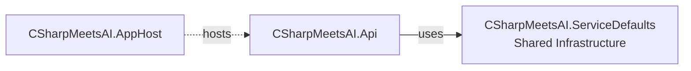

# CSharpMeetsAI

A beginner-friendly exploration of AI integration with .NET and C#. This project uses [Ollama](https://ollama.com/) and aims to try other tools to build real-world applications. Perfect for developers curious about **AI** and modern .NET capabilities.

## 🚀 Goals

- Learn how to integrate AI models with C# and .NET
- Experiment with local LLMs using Ollama.
- Experiment MCP Servers.
- Experiment Microsoft Agent Framework.
- Build simple, real-world AI-powered applications.

## .NET Projects

- `CSharpMeetsAI.AppHost`: Serves as the entry point and host for the application, managing configuration and startup logic.
- `CSharpMeetsAI.ServiceDefaults`: Provides default implementations and shared utilities to support the service layer.
- `CSharpMeetsAI.Api`: Exposes HTTP endpoints, handles requests/responses.

### 🏗️ Component Dependencies

## 🛠️ Tools & Technologies

- [.NET 9](https://dotnet.microsoft.com/)
- [Ollama](https://ollama.com/)
- [Aspire](https://learn.microsoft.com/en-us/dotnet/aspire/get-started/aspire-overview)
- C#
- ASP.NET Core

## 📦 Getting Started

1. Install .NET SDK
2. Run docker desktop
3. Clone this repository
4. Run the sample project: `dotnet run --project src/CSharpMeetsAI.AppHost`