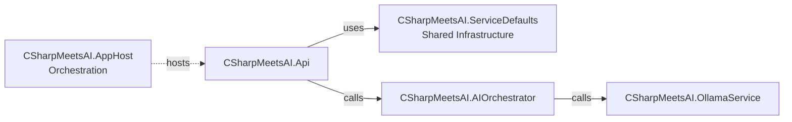
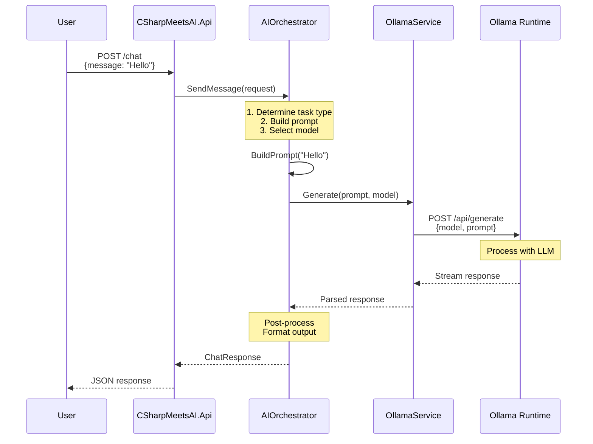

# CSharpMeetsAI

A beginner-friendly exploration of AI integration with .NET and C#. This project uses [Ollama](https://ollama.com/) and other tools to build real-world applications. Perfect for developers curious about local AI and modern .NET capabilities.

## 🚀 Goals

- Learn how to integrate AI models with C# and .NET
- Experiment with local LLMs using Ollama
- Build simple, real-world AI-powered applications

## .NET Projects

- `CSharpMeetsAI.AppHost`: Serves as the entry point and host for the application, managing configuration and startup logic.
- `CSharpMeetsAI.ServiceDefaults`: Provides default implementations and shared utilities to support the service layer.
- `CSharpMeetsAI.Api`: Exposes HTTP endpoints, handles requests/responses.
- `CSharpMeetsAI.OllamaService`: Low-level wrapper for Ollama API, handles prompt execution
- `CSharpMeetsAI.AIOrchestrator`: Acts as the brain of the application, e.g it's responsible of deciding what task to perform, formatting prompts and chaining logic.

### 🏗️ Component Dependencies

```mermaid
graph LR
    AppHost[CSharpMeetsAI.AppHost<br/>Orchestration]
    ServiceDefaults[CSharpMeetsAI.ServiceDefaults<br/>Shared Infrastructure]
    API[CSharpMeetsAI.Api]
    Orchestrator[CSharpMeetsAI.AIOrchestrator]
    OllamaService[CSharpMeetsAI.OllamaService]

    AppHost -.->|hosts| API
    API -->|uses| ServiceDefaults
    API -->|calls| Orchestrator
    Orchestrator -->|calls| OllamaService
```

### Request Flow

```mermaid
sequenceDiagram
    participant User
    participant API as CSharpMeetsAI.Api
    participant Orch as AIOrchestrator
    participant OllSvc as OllamaService
    participant Ollama as Ollama Runtime

    User->>API: POST /chat<br/>{message: "Hello"}
    API->>Orch: SendMessage(request)

    Note over Orch: 1. Determine task type<br/>2. Build prompt<br/>3. Select model

    Orch->>Orch: BuildPrompt("Hello")
    Orch->>OllSvc: Generate(prompt, model)

    OllSvc->>Ollama: POST /api/generate<br/>{model, prompt}

    Note over Ollama: Process with LLM

    Ollama-->>OllSvc: Stream response
    OllSvc-->>Orch: Parsed response

    Note over Orch: Post-process<br/>Format output

    Orch-->>API: ChatResponse
    API-->>User: JSON response
```

## 🛠️ Tools & Technologies

- [.NET 9](https://dotnet.microsoft.com/)
- [Ollama](https://ollama.com/)
- [Aspire](https://learn.microsoft.com/en-us/dotnet/aspire/get-started/aspire-overview)
- C#
- ASP.NET Core

## 📦 Getting Started

1. Install .NET SDK
2. Install Ollama and run a model (e.g. `ollama run phi3`)
3. Clone this repository
4. Run the sample project: `dotnet run --project src/CSharpMeetsAI.AppHost`
